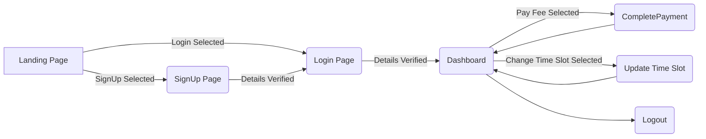

# Yoga-Class by Flexmoney-
This website aims at providing the yoga classes to differenct at groups(18-65) with flexible timeslots at a nominal charges of Rs.500.

# ER Diagram

## Approach

The website is build using HTML and Bootstrap as front-end and NodeJS as back-end. 
1. The site starts with a landing page.
2. The user is given with two options:
			  a. Login(For Existing Users)
			  b. Sign Up(For new users): Checks have been imposed such as age should 	be between 18-65 only and to choose the timeslot.
3. Login is built using Passport.JS with a local strategy which can be easily converted to use automatic  logins like Google.
4. After logging in, the user lands on dashboard where he/she is provided with the schedule of upcoming 6 days.
5. An option to pay fee which is connected to CompletePayment() function is provided, and one can easily navigate to the dashboard to pay the fee later.
6. Another option to change the time slot is provided which will be reflected the next month's starting as it automatically gets updated in SQL database when one triggers to change the time slot.

## Flow Chart

